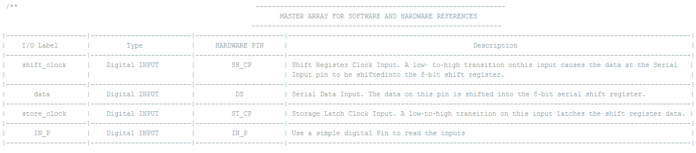

# Overview

The IOExtension Library was developed by MEGA DAS community in order to facilitate the use of the Digital Extension module (Based on 74HC595 shift regisrters) made by the same community. This library contain all the necessery APIs that can be used in your code written in the Arduino IDE for sure after adding this library to your libreries directory.
The package contain also the exemples file where you can find some basic exemples to demonstrate how to wire the module to your Board and how to exploit the APIs like the DigitalRead and DigitalWrite exemples that shows the same behavior as the Arduino digitalRead and digitalWrite APIs.
# NOTE:
This library is based on SPI communication protocal so please follow the description that we mentioned on our exemples to make sure that you properly wired your module. 
 	
# Problems & Objectives

A lot of Dev Boards like Arduino, STM, ChipKit etc (Even micro computers like Raspberry Pi) has a limited number of Digital input and output pins, which is a serious problem for the makers while creating them projects, especially when the Dev Board should be connected to an important number of peripheric (Exemple: the 5x5x5 LED Cube where you need to control more than 100 LED).
Our goal is to satisfy the users desires by making a Hardware and Software solution to add more Digital I/O pins to your Dev Boards.

# About the Hardware (the Module)

The IOExtension module is based on four shift registers (74HC595) to provide 16 Digital Inputs and 16 Digital Outputs, you will need only four pins in your Dev Board to control the module, plus the Vcc and the Gnd pins.

I recommend for you the easyEDA which is a web-based EDA tool suite that enables hardware engineers to design, simulate, share - publicly and privately - and discuss schematics, simulations and printed circuit boards for sure with the ability of en ligne orders.
So you can make your own PCB for this module or for your other projects and here is the link for the [easyEDA](https://www.easyeda.com ).
The module can be connected to any Dev Board because of its flexible library.

# About the Software (the Library)

We tried to make sure that you will not find any coding errors caused by this library after testing it with a lot of exemples and different uses combinations. The library allows users to write the minimum of code to control all the inputs and outputs, so using only two simple instructions like DigitalRead(Pinx) or DigitalWrite(Pinx, value) you can directly make the module operates the way you want  and for sure the MEGA DAS community created this Arduino library to explain the use of the module through some exemples.
